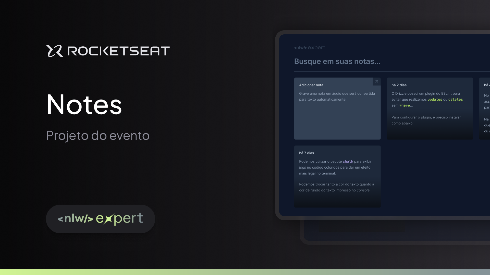

<h1 align="center"> Expert Notes - NLW Expert </h1>

[Clique aqui para acessar]()

## 🚀 Tecnologias

Esse projeto foi desenvolvido com as seguintes tecnologias:

- [React](https://react.dev/)
- [Typescript](https://www.typescriptlang.org/)
- [Tailwind CSS](https://tailwindcss.com/)
- Git and GitHub

## 💻 Projeto

O Expert Notes é um aplicativo de notas onde os usuários podem criar anotações digitando ou gravando áudio. Além disso, oferece a funcionalidade de busca para que os usuários possam facilmente encontrar suas notas usando filtros de pesquisa.  

Projeto construído no NLW Expert promovido pela [Rocketseat](https://www.rocketseat.com.br/).

## 🔧 Funcionalidades

- Layout responsivo;
- Filtragem de notas;
- Criação de notas por áudio;
- Armazenamento persistente das notas;

## 🔖 Layout

Você pode visualizar o layout do projeto proposto através [DESSE LINK](https://www.figma.com/community/file/1336456128647909148/nlw-expert-notes). É necessário ter conta no [Figma](https://figma.com) para acessá-lo.